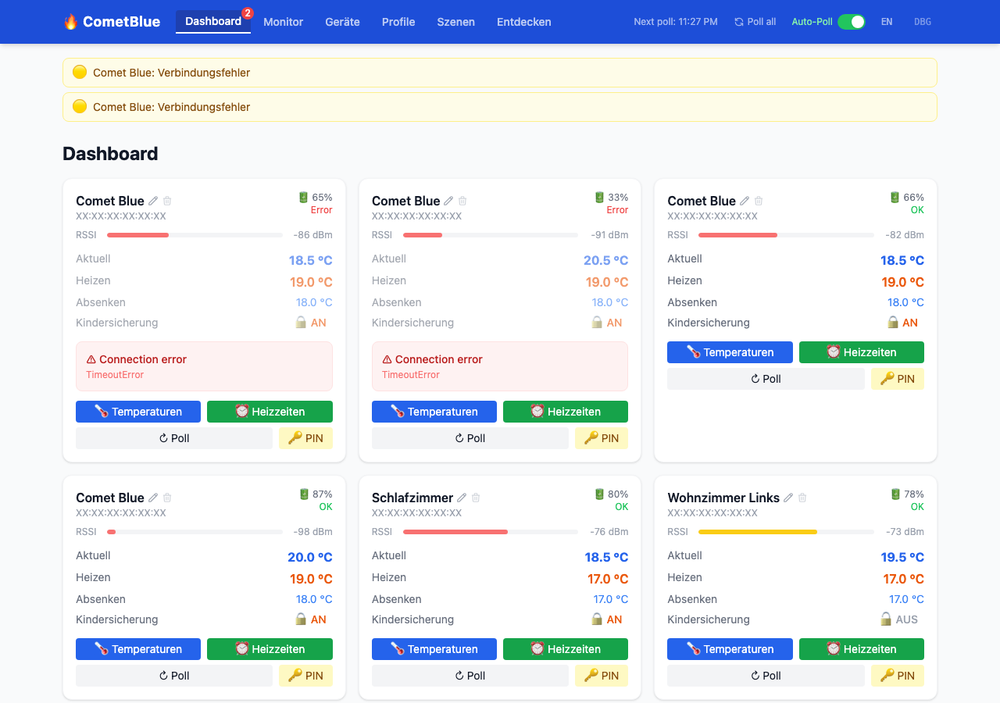
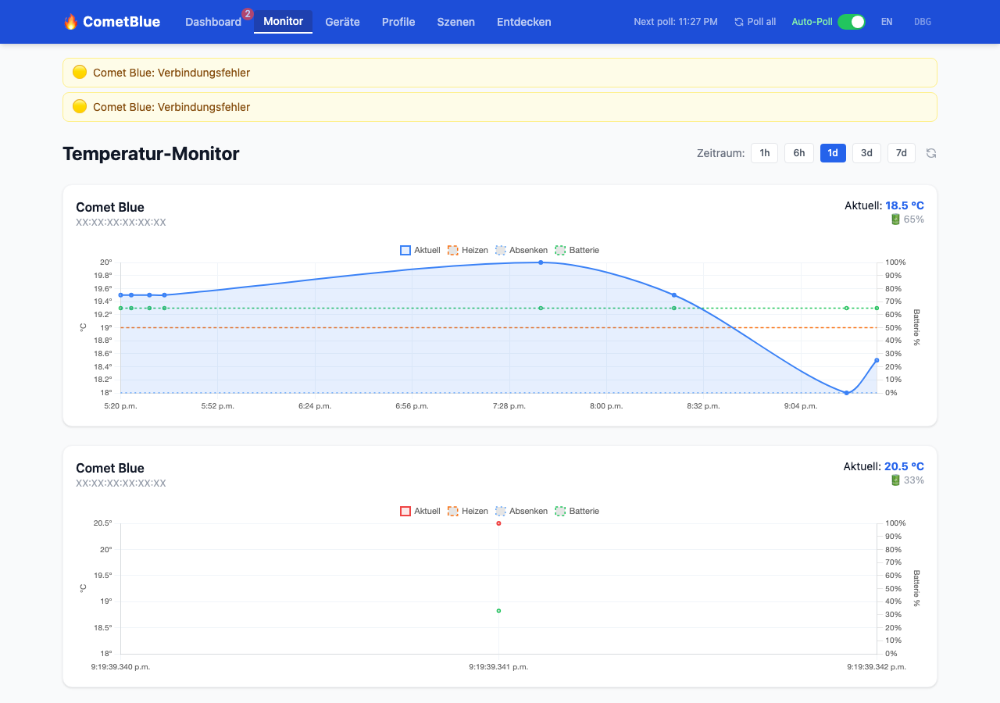
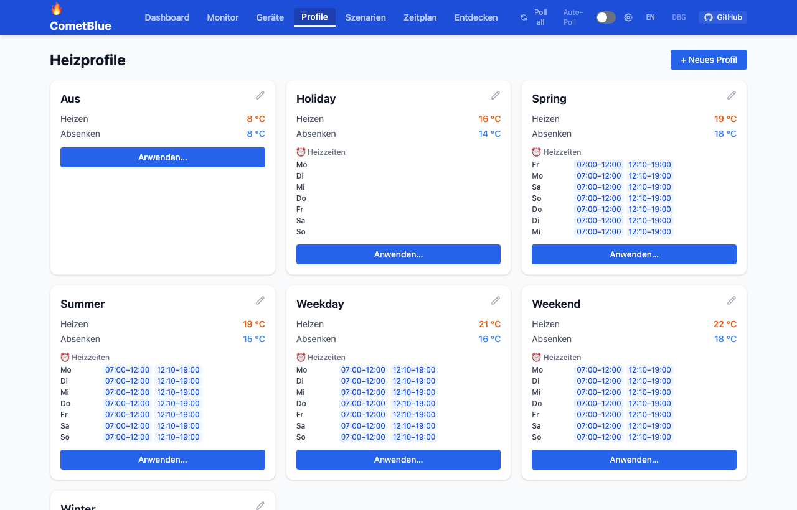
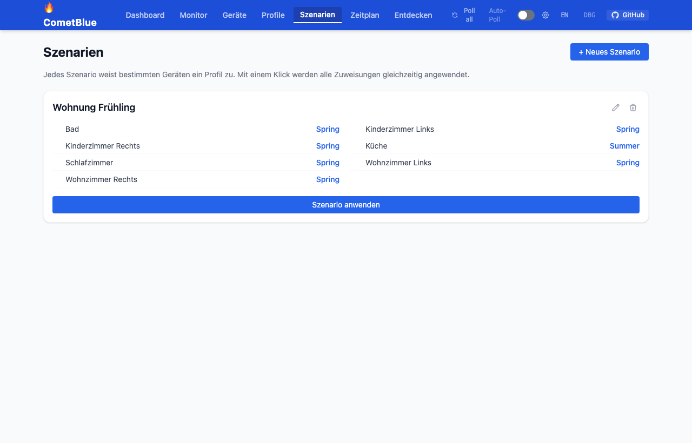
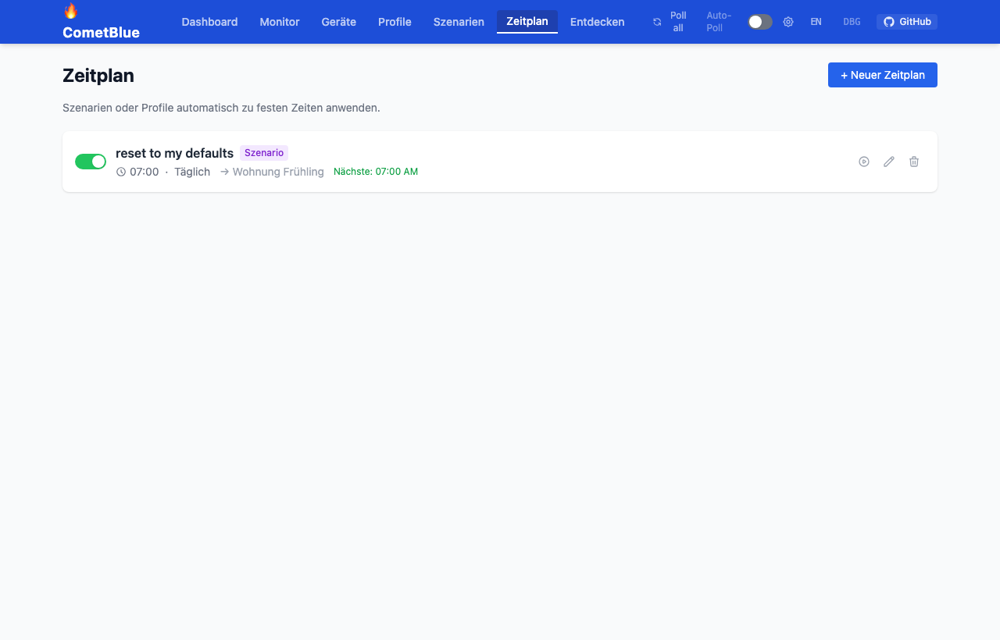
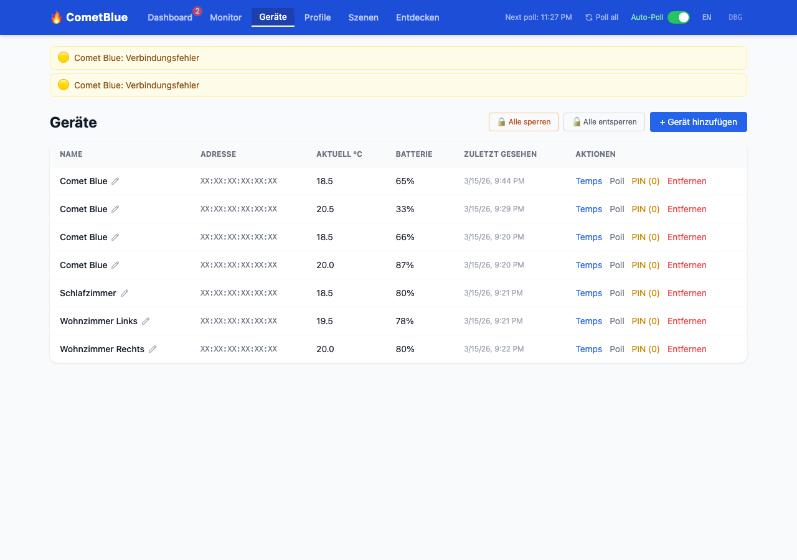
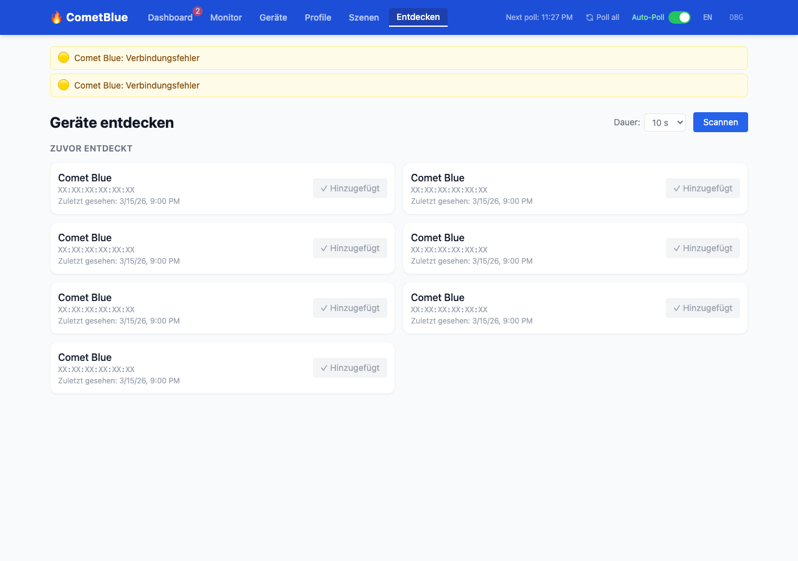
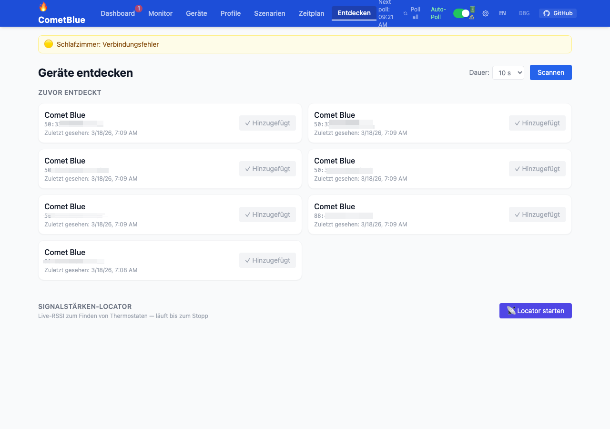
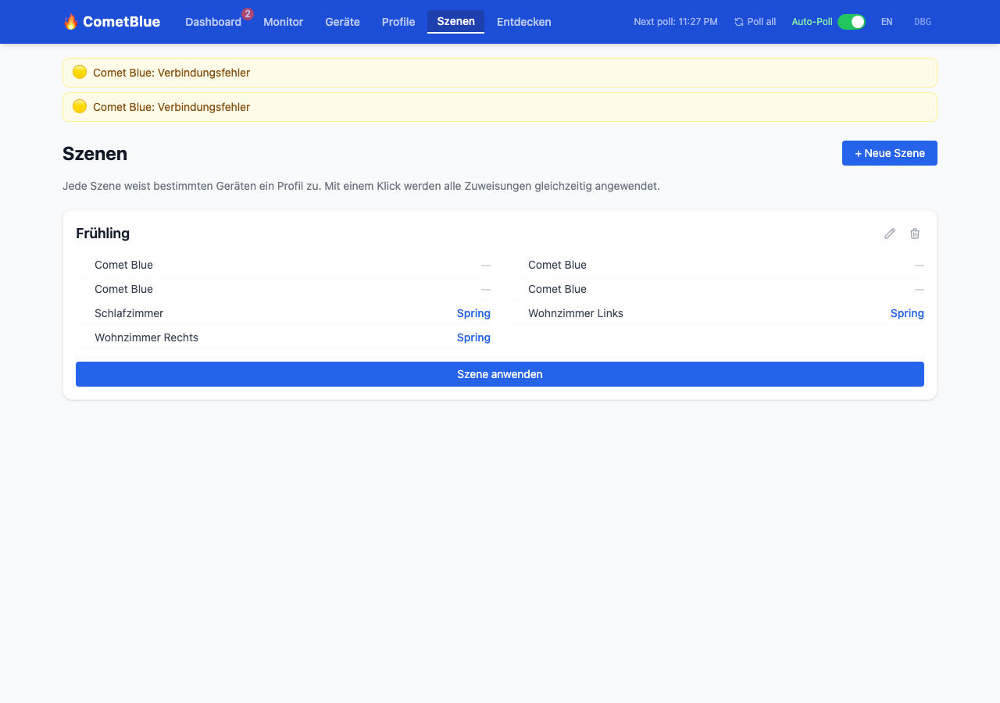

# CometBlue Control

Cross-platform management system for **CometBlue / Comet Blue**, **Xavax Hama**, and **Sygonix HT100 BT** Bluetooth Low Energy radiator thermostats. Runs on macOS, Linux, and Raspberry Pi.

[](docs/api.md)
[](docs/mcp.md)
[](docs/screenshots/dashboard.png)
[](README.md)

> **REST API** · **Web UI** · **MCP Server (AI)** · **CLI** — all from a single Python package.



| Monitor | Profile |
|---------|---------|
|  |  |

| Szenarien | Zeitplan |
|-----------|----------|
|  |  |

<details>
<summary>Weitere Screenshots</summary>

| Geräte | Entdecken |
|--------|-----------|
|  |  |

| Entdecken + Locator | Locator aktiv |
|---------------------|--------------|
|  |  |

| Temperaturen setzen | Heizzeiten setzen |
|--------------------|-------------------|
|  |  |

| Profil bearbeiten | Szenario bearbeiten |
|-------------------|---------------------|
|  |  |

| Zeitplan bearbeiten | PIN setzen |
|--------------------|-----------|
|  |  |

</details>

---

Provides a REST API, optional Web UI, MCP server (for AI integration), and CLI — all from a single Python package.

> **Compatible devices:** Comet Blue · Xavax Hama · Sygonix HT100 BT (all share the same BLE protocol)

> **Web UI language:** English / German switchable in the nav bar

> **Platform status:** macOS · Linux · Raspberry Pi

---

## Features

- **Automatic BLE discovery** — scans and identifies CometBlue devices; live **Signal Strength Locator** shows RSSI for all nearby thermostats in real time (continuous scan with stop button, sorted by signal strength)
- **Full thermostat control** — temperatures, weekly schedules, holiday slots, time sync
- **Child lock control** — toggle per device or bulk-set all devices at once; optionally part of a profile
- **Background polling** — regularly reads all configured devices (configurable interval, on/off toggle persisted in DB)
- **Poll safety** — auto-poll and manual polls are mutually exclusive; a running poll is always visible in the UI with a per-device progress indicator
- **Alert system** — banner warnings for low battery, connection errors, and devices not yet polled
- **Heating profiles** — Winter, Summer, Spring, Holiday, Aus, Weekend, Weekday; optional child lock per profile
- **Scenarios (Szenarien/Presets)** — assign different profiles to different devices, save as named scenarios, apply all at once with live progress
- **Scheduler (Zeitplan)** — automatically apply scenarios or profiles on a schedule (time + days of week)
- **Temperature history / monitoring** — chart with dual Y-axis (temperature + battery)
- **REST API** — complete OpenAPI-documented HTTP API with SSE streaming for long-running operations
- **Web UI** — single-page dashboard (Alpine.js + Tailwind, no build step required)
- **MCP server** — Model Context Protocol for AI assistant integration
- **CLI** — command-line tools for scripting
- **SQLite storage** — devices, history, settings, presets
- **MAC-based identity** — stores device MAC after first poll; auto-resolves new UUID after battery swap (macOS)
- **Platform-agnostic** — uses `bleak` for BLE (replaces Linux-only `gattlib`)

---

## Compatible Devices

All of the following devices share the same BLE protocol and are fully supported:

| Brand | Model |
|-------|-------|
| EUROtronic | Comet Blue |
| Hama | Xavax (Article 00176592) |
| Sygonix | HT100 BT |

> There are likely other rebranded versions of the same hardware. If yours works, please open an issue to add it to this list.

---

## Requirements

- Python 3.10+
- Bluetooth 4.0+ adapter (built-in or USB dongle)
- On Linux/RPi: BlueZ (`sudo apt install bluetooth bluez`)
- On macOS: Core Bluetooth (built-in, Bluetooth permission required)

---

## Installation

Use the platform-specific installer for your system:

### macOS

```bash
git clone https://github.com/danielgohlke/cometblue-control
cd cometblue-control
./install-macos.sh

# With MCP server support:
./install-macos.sh --with-mcp

# With auto-start at login (launchd):
./install-macos.sh --launchd
```

On first run, macOS will prompt for Bluetooth permission — grant it in
**System Settings → Privacy & Security → Bluetooth**.

### Linux (x86_64 / generic)

```bash
git clone https://github.com/danielgohlke/cometblue-control
cd cometblue-control
./install-linux.sh

# With MCP server support:
./install-linux.sh --with-mcp

# With systemd auto-start (installs to /opt/cometblue-control):
./install-linux.sh --systemd

# Custom install directory:
./install-linux.sh --systemd --install-dir=/home/myuser/cometblue-control
```

Supports apt (Debian/Ubuntu), dnf (Fedora), and pacman (Arch).

The installer automatically:
- Installs BlueZ and Python via the system package manager
- Enables the Bluetooth service
- Adds your user to the `bluetooth` group
- Copies files to the install directory and creates a venv

**With `--systemd`:**
- Installs `/etc/systemd/system/cometblue.service`
- Enables and starts the service immediately

```bash
# Service management
sudo systemctl status cometblue
sudo systemctl restart cometblue
sudo systemctl stop cometblue

# Logs (live)
journalctl -u cometblue -f

# Update: pull changes, then restart
cd /opt/cometblue-control
git pull
source .venv/bin/activate && pip install -e "."
sudo systemctl restart cometblue
```

> **Note:** After `./install-linux.sh`, log out and back in for the `bluetooth` group to take effect — otherwise BlueZ may deny BLE access.

#### Manual systemd setup

If you prefer to set up the service manually:

```bash
# 1. Copy and adapt the unit file
sudo cp systemd/cometblue.service /etc/systemd/system/

# Edit User=, WorkingDirectory=, ExecStart= to match your setup:
sudo systemctl edit --force cometblue.service

# 2. Enable and start
sudo systemctl daemon-reload
sudo systemctl enable --now cometblue
```

The unit file (`systemd/cometblue.service`) uses `%i` as a placeholder for the username — replace it with your user or pass it via `systemctl enable cometblue@youruser.service` if you rename it to `cometblue@.service`.

### Raspberry Pi

```bash
git clone https://github.com/danielgohlke/cometblue-control
cd cometblue-control
./install-raspberry.sh

# With MCP server support:
./install-raspberry.sh --with-mcp
```

The Raspberry Pi installer automatically:
- Installs BlueZ and enables Bluetooth
- Unblocks Bluetooth via rfkill
- Adds your user to the `bluetooth` group
- Installs and starts the systemd service
- Sets `poll_interval: 900` (recommended 15 min; Pi 3B+ needs ~45s per device)

> **Notes:**
> Each device takes ~45s to poll on Pi 3B+ (GATT service discovery).
> If BLE stops working: `sudo systemctl restart cometblue`

### Manual install

```bash
cd cometblue-control
python3 -m venv .venv
source .venv/bin/activate         # Linux/macOS

pip install -e "."                # core + API + UI
pip install -e ".[mcp]"           # + MCP server
pip install -e ".[mcp,dev]"       # + dev/test tools
```

---

## Uninstall

```bash
./uninstall.sh
```

Removes the install directory and (on Linux/Pi) the systemd service / (on macOS) the launchd agent. Config is kept by default.

| Option | Effect |
|--------|--------|
| *(none)* | Remove install dir + service; keep `~/.cometblue` |
| `--purge` | Also delete `~/.cometblue` (config, profiles, DB, logs) |
| `--install-dir=DIR` | Override the install directory to remove |
| `--yes` / `-y` | Skip confirmation prompt |

**Examples:**

```bash
# Normal uninstall (keeps config)
./uninstall.sh

# Full removal including config
./uninstall.sh --purge

# Custom install directory
./uninstall.sh --install-dir=/home/myuser/cometblue-control

# Non-interactive (e.g. in a script)
./uninstall.sh --purge --yes
```

---

## Quick Start

```bash
source .venv/bin/activate

# 1. Start the server
cometblue-control serve
#    Web UI:  http://localhost:8080
#    API docs: http://localhost:8080/docs

# 2. Scan for devices
cometblue-control discover

# 3. Check device status (once added via UI or API)
cometblue-control status E0:E5:CF:C1:D4:3F

# 4. List available profiles
cometblue-control list-profiles
```

---

## Configuration

The config file is created at `~/.cometblue/config.yaml` on first run. Edit it to adjust settings:

```yaml
host: "0.0.0.0"
port: 8080               # change port here, or use: cometblue-control serve --port 9000
poll_interval: 900       # seconds between polls (default: 15 min — see warning below)

bluetooth:
  adapter: null          # null = system default, or "hci0" on Linux
  scan_timeout: 10

ui:
  enabled: true

log_level: "INFO"
```

Runtime settings (e.g. `auto_poll`, `poll_interval`) are stored in the database and survive restarts. They can be changed via the ⚙ settings button in the Web UI nav bar or via the settings API.

To verify that a settings change took effect, watch the live log:

```bash
journalctl -u cometblue -f
```

You should see a line like `Poll interval updated to 900s` immediately after saving.

> **Battery note:** Auto-poll is **disabled by default**. Each BLE poll connects to the thermostat and wakes it up, which consumes battery. Enable it only if you need continuous monitoring.

> ⚠️ **Firmware bug — device freeze:** CometBlue thermostats have a known firmware bug where polling too frequently causes the device to stop responding entirely. The only recovery is to **remove and reinsert the battery**. The recommended poll interval is **15 minutes (900 s) or more**. The Web UI enforces a minimum of 15 minutes when changed via settings.

### Profiles

Profiles live in `~/.cometblue/profiles/`. Each YAML file defines temperature setpoints, an optional child lock setting, and optional weekly schedules:

```yaml
# ~/.cometblue/profiles/my_profile.yaml
name: My Profile
comfort_temp: 22.0       # heating "on" temperature
eco_temp: 17.0           # heating "off" / reduced temperature
manual_temp: 20.0        # manual override temperature
child_lock: false        # true = lock on, false = lock off, omit = don't change
schedules:
  monday:
    - {start: "07:00", end: "12:00"}
    - {start: "12:10", end: "19:00"}
  tuesday:
    - {start: "07:00", end: "12:00"}
    - {start: "12:10", end: "19:00"}
  # ... wednesday through sunday
  saturday:
    - {start: "07:00", end: "12:00"}
    - {start: "12:10", end: "19:00"}
  sunday:
    - {start: "07:00", end: "12:00"}
    - {start: "12:10", end: "19:00"}
```

Up to 4 time periods per day. Omit a day to leave its schedule unchanged when applying. Omit `child_lock` to leave it unchanged.

**Built-in profiles:**

| Profile | Heizen | Absenken | Notes |
|---------|--------|----------|-------|
| `winter` | 22.5 °C | 19.0 °C | Standard winter heating |
| `summer` | 19.0 °C | 15.0 °C | Light summer mode |
| `spring` | 19.0 °C | 18.0 °C | Spring / mild weather |
| `holiday` | 15.0 °C | 10.0 °C | Away from home |
| `aus` | 8.0 °C | 8.0 °C | Frost protection / off |
| `weekend` | 22.0 °C | 17.0 °C | Extended weekend times |
| `weekday` | 22.0 °C | 17.0 °C | Compact weekday times |

---

## Screenshots

| Dashboard | Monitor |
|-----------|---------|
|  |  |

| Profiles | Scenes |
|----------|--------|
|  |  |

---

## Web UI

Start the server and open **http://localhost:8080**.

| Page | Description |
|---|---|
| **Dashboard** | Live status cards for all devices — temperatures, battery, RSSI, child lock toggle |
| **Monitor** | Temperature + battery history chart (dual Y-axis) per device |
| **Devices** | Full device list — poll, set temps, schedules, child lock, rename, reset data |
| **Profiles** | View, create, edit and apply heating profiles with schedule and child lock settings |
| **Scenes** | Named scenes: assign one profile per device, apply all at once with live progress bar |
| **Discovery** | BLE scan, add found devices with one click; built-in **Signal Strength Locator** for finding thermostats by proximity |

### Nav bar

- **Auto-poll toggle** — enable/disable background polling (persisted in DB)
- **Poll all button** — triggers an immediate BLE poll of all devices sequentially; the spinner and loading bar move to each device card as it is being polled; auto-poll is blocked while a manual poll is running and vice versa
- **Alert badge** — shows count of active alerts (low battery, errors, unpolled devices)

### Alert banner

Shown automatically when:
- Battery ≤ 10% → critical (red)
- Battery ≤ 20% → warning (yellow)
- Device has a connection error
- Device has never been polled

> **Note on battery levels:** CometBlue reports raw voltage without calibration. New batteries typically show ~80–90%, not 100%.

### Child lock

- Click `🔒 AN` / `🔓 AUS` on any device card to toggle instantly
- On the Devices page: **"🔒 Alle sperren"** / **"🔓 Alle entsperren"** buttons to bulk-set all devices
- Set `child_lock: true/false` in a profile to apply it automatically when the profile is applied

---

## Scenes (Szenen/Presets)

A scene stores a mapping of device → profile. Applying a scene writes each profile to its assigned device simultaneously, with a live progress bar showing per-device status.

**Example use case:** "Winter" scene → Wohnzimmer=winter, Schlafzimmer=winter, Bad=winter, Küche=spring.

Scenes are managed in the **Scenes** tab of the Web UI or via the REST API.

---

## REST API

> 📄 **[Full API Reference → docs/api.md](docs/api.md)**

Interactive Swagger UI at **`http://localhost:8080/docs`** when the server is running.

### Endpoints overview

```
# Devices
GET|POST          /api/devices
GET|PATCH|DELETE  /api/devices/{address}
GET               /api/devices/{address}/status    Cached status (instant, no BLE)
GET               /api/devices/{address}/info      Cached metadata
POST              /api/devices/{address}/poll       Immediate BLE poll
POST              /api/devices/poll-all             Poll all (background)
GET               /api/devices/poll-all-status      Poll progress
PATCH             /api/devices/{address}/flags      Child lock
POST              /api/devices/set-child-lock       Bulk child lock
POST              /api/devices/{address}/rediscover UUID refresh after battery swap

# Temperatures & Time
GET|PUT           /api/devices/{address}/temperatures
POST              /api/devices/{address}/sync-time

# Schedules (weekly heating plan)
GET|PUT           /api/devices/{address}/schedules
PUT               /api/devices/{address}/schedules/{day}

# Holidays (8 slots per device)
GET               /api/devices/{address}/holidays
PUT|DELETE        /api/devices/{address}/holidays/{slot}

# Profiles (YAML files in ~/.cometblue/profiles/)
GET               /api/profiles
GET|PUT|DELETE    /api/profiles/{name}
POST              /api/profiles/{name}/apply

# Scenarios (profile per device)
GET|POST          /api/presets
GET|PUT|DELETE    /api/presets/{id}
POST              /api/presets/{id}/apply           SSE stream with per-device progress

# Scheduler (auto-apply at set times)
GET|POST          /api/auto-triggers
PUT|DELETE        /api/auto-triggers/{id}
POST              /api/auto-triggers/{id}/run

# Discovery
GET               /api/discovery/stream             SSE stream of found devices (with timeout)
GET               /api/discovery/locator            SSE stream: continuous RSSI locator (runs until disconnect)
GET               /api/discovery/known              Persisted scan results

# History
GET               /api/history/{address}            ?hours=24 or ?from=&to=&limit=
GET               /api/history                      All devices (Monitor chart)

# Settings & System
PATCH             /api/settings/auto_poll
PUT               /api/settings/poll-interval
GET               /api/status
```

**Bulk child lock example:**
```bash
# Lock all devices:
curl -X POST http://localhost:8080/api/devices/set-child-lock \
  -H "Content-Type: application/json" \
  -d '{"enabled": true, "addresses": ["all"]}'

# Unlock specific devices:
curl -X POST http://localhost:8080/api/devices/set-child-lock \
  -H "Content-Type: application/json" \
  -d '{"enabled": false, "addresses": ["E0:E5:CF:C1:D4:3F", "AA:BB:CC:DD:EE:FF"]}'
```

**Set child lock on one device:**
```bash
curl -X PATCH http://localhost:8080/api/devices/E0:E5:CF:C1:D4:3F/flags \
  -H "Content-Type: application/json" \
  -d '{"child_lock": true}'
```

→ **[Full API Reference with examples and response schemas: docs/api.md](docs/api.md)**

---

## MCP Server

> 📄 **[Full MCP Documentation → docs/mcp.md](docs/mcp.md)**

The MCP server lets AI assistants (Claude) control your thermostats directly via natural language. It uses stdio transport and shares the same database as the REST API.

### Quick setup

```bash
# Claude Code CLI (recommended):
claude mcp add cometblue -- /path/to/cometblue-control/.venv/bin/cometblue-control mcp

# Or JSON config (~/.claude.json):
```
```json
{
  "mcpServers": {
    "cometblue": {
      "type": "stdio",
      "command": "/path/to/cometblue-control/.venv/bin/cometblue-control",
      "args": ["mcp"],
      "env": {}
    }
  }
}
```

### Available tools

| Tool | Description |
|---|---|
| `list_devices` | All devices with last known status (no BLE) |
| `get_device_status` | Status for one device (no BLE) |
| `set_temperature` | Set comfort / eco / manual setpoints |
| `apply_profile` | Apply a heating profile to all or specific devices |
| `list_profiles` | List available profiles |
| `list_scenarios` | List all scenarios |
| `apply_scenario` | Apply a scenario by ID |
| `discover_devices` | BLE scan for nearby devices |
| `get_schedule` | Read weekly schedule from device |
| `set_schedule` | Write schedule for one day |
| `get_holidays` | Read all 8 holiday slots |
| `set_holiday` | Set a holiday period |
| `get_history` | Query temperature history |
| `sync_time` | Sync device clock to system time |

→ **[Full tool reference with inputs, outputs and examples: docs/mcp.md](docs/mcp.md)**

---

## CLI Reference

```bash
cometblue-control [OPTIONS] COMMAND

Options:
  -c, --config-file PATH   Custom config file
  -l, --log-level TEXT     DEBUG | INFO | WARNING | ERROR

Commands:
  serve           Start API server (+ Web UI)
  mcp             Start MCP server (stdio)
  discover        Scan for CometBlue devices
  status ADDRESS  Poll device and show status
  list-profiles   List available profiles
```

**Examples:**

```bash
# Start with custom port
cometblue-control serve --port 9000

# Discover with longer timeout
cometblue-control discover --timeout 20

# Get device status as JSON
cometblue-control status E0:E5:CF:C1:D4:3F --json

# Start MCP (for Claude Code integration)
cometblue-control mcp
```

---

## Raspberry Pi Setup

```bash
git clone https://github.com/danielgohlke/cometblue-control
cd cometblue-control
./install-raspberry.sh

# Check service
sudo systemctl status cometblue

# View logs
journalctl -u cometblue -f
```

Access the UI from another device: `http://<raspberry-pi-ip>:8080`

### Deployment with Ansible

The `deploy/` directory contains an Ansible playbook for automated deployment to a Raspberry Pi.

**Prerequisites:**
```bash
pip install ansible
# SSH key auth must be set up (no password prompt)
ssh-copy-id USER@raspberry.local
```

**Configure inventory** (`deploy/inventory.ini`):
```ini
[cometblue]
raspberrypi ansible_host=raspberry.local ansible_user=YOUR_USER
```

**First deploy** (installs all packages, creates venv, sets up systemd service):
```bash
ansible-playbook -i deploy/inventory.ini deploy/deploy.yml
```

**Update** (rsync code, reinstall pip packages, restart service):
```bash
ansible-playbook -i deploy/inventory.ini deploy/deploy.yml --tags update
```

What the playbook does:
- Installs system packages: `python3`, `python3-venv`, `bluetooth`, `bluez`, `git`
- Adds the user to the `bluetooth` group
- Syncs code to `/opt/cometblue-control/` via rsync (excludes `.git`, `.venv`, `__pycache__`)
- Creates a virtualenv and installs the package with `pip install -e .`
- Copies default config/profiles to `~/.cometblue/` (existing config is never overwritten)
- Installs and starts the `cometblue.service` systemd unit

**Check service status on the Pi:**
```bash
ssh USER@raspberry.local "journalctl -u cometblue -f"
```

### Service logs

```bash
# Live-Log (follow)
journalctl -u cometblue -f

# Last 100 lines
journalctl -u cometblue -n 100

# Since today
journalctl -u cometblue --since today

# Filter errors only
journalctl -u cometblue -p err
```

### Log level

Edit `~/.cometblue/config.yaml` on the Pi:

```yaml
log_level: "WARNING"   # errors + warnings only (quieter)
log_level: "INFO"      # normal (default)
log_level: "DEBUG"     # verbose — all BLE operations
```

Then restart the service:
```bash
sudo systemctl restart cometblue
```

### Bluetooth permissions on Linux

If you get permission errors with Bluetooth:

```bash
sudo usermod -aG bluetooth $USER
# Log out and back in, then retry
```

---

## BLE Protocol Reference

CometBlue uses a proprietary BLE GATT profile. Full protocol documentation by Torsten Tränkner:
https://www.torsten-traenkner.de/wissen/smarthome/heizung.php

### GATT Characteristics

All custom characteristics share the base UUID `47e9ee__-47e9-11e4-8939-164230d1df67` where `__` is the suffix below.

| Suffix | Name | R/W | Description |
|--------|------|-----|-------------|
| `ee01` | datetime | R/W | 5 bytes: minute, hour, day, month, year−2000 |
| `ee2a` | flags | R/W | Status bitmap: child lock, manual mode, DST, anti-frost |
| `ee2b` | temperatures | R/W | 7 signed bytes — each value ÷ 2 = °C (see below) |
| `ee2c` | battery | R | 1 byte: 0–100 (%), 255 = unavailable |
| `ee2d` | firmware_revision2 | R | String |
| `ee2e` | lcd_timer | R/W | LCD backlight timeout |
| `ee30` | pin | W | PIN authentication, 4-byte little-endian |
| `ee10`–`ee16` | day 1–7 (Mon–Sun) | R/W | Weekly schedule, 8 bytes per day (see below) |
| `ee20`–`ee27` | holiday 1–8 | R/W | Holiday slots, 9 bytes each (see below) |

### Temperature characteristic (suffix `ee2b`)

7 bytes. Each value is stored as `raw = °C × 2` (signed). Write `0x80` to leave a value unchanged.

| Byte | Field | Notes |
|------|-------|-------|
| 0 | Current temperature | Read-only — measured room temperature |
| 1 | Manual setpoint | Active when device is in manual mode |
| 2 | Comfort setpoint | Active during scheduled "on" periods |
| 3 | Eco setpoint | Active outside scheduled periods |
| 4 | Offset | Calibration offset added to measured temperature |
| 5 | Window open temperature | Temperature to drop to when window-open is detected |
| 6 | Window open duration | Minutes to stay at window temperature |

### Flags characteristic (suffix `ee2a`)

3 bytes. Relevant bits (empirically confirmed):

| Byte | Bit | Mask | Meaning |
|------|-----|------|---------|
| 0 | 7 | `0x80` | Child lock (1 = locked) |
| 0 | 0 | `0x01` | DST active |
| 0 | 2 | `0x04` | Anti-frost mode |
| 1 | 1 | `0x02` | Manual mode |

Requires PIN authentication before read/write.

### Schedule characteristic (suffixes `ee10`–`ee16`)

8 bytes = 4 time periods. Each period is 2 bytes: `(start, end)` in 10-minute steps (0 = 00:00, 144 = 24:00). Unused periods use `0xFF`.

Example: `07:00–22:00` → start = 42, end = 132.

### Holiday characteristic (suffixes `ee20`–`ee27`)

9 bytes encoding a start datetime (5 bytes), end datetime (4 bytes), and target temperature (1 byte, ÷2 = °C). Write all zeros to clear a slot.

### PIN authentication

Before accessing protected characteristics (temperatures, schedules, flags), write the PIN as a 4-byte little-endian integer to suffix `ee30`. Example: PIN `1234` (decimal) → bytes `D2 04 00 00`.

### Platform-specific BLE behaviour

| Platform | BLE stack | Addressing | Connect timeout | Poll order |
|----------|-----------|------------|-----------------|------------|
| macOS | CoreBluetooth | Random UUID (per Mac) | 15 s | Sequential |
| Linux | BlueZ (D-Bus) | MAC address | 45 s | Sequential |
| Raspberry Pi | BlueZ + dbus-fast | MAC address | 45 s | Sequential |

On macOS the `adapter` parameter is ignored (CoreBluetooth manages adapters transparently). On Linux/Pi `hci0` (or another adapter) can be set in `config.yaml → bluetooth.adapter`. The BLE lock ensures only one GATT connection is open at a time on every platform.

### Device addressing on macOS

On macOS, CoreBluetooth does **not** expose real Bluetooth MAC addresses. Instead it assigns a random UUID per device that is stable per Mac but changes after a battery replacement.

CometBlue Control handles this automatically:
1. After the first successful poll, the real MAC address is read from the standard **System ID** GATT characteristic and stored in the database.
2. If the stored UUID is no longer found (e.g. after a battery swap), a BLE scan matches the device by MAC address and the UUID is updated automatically.

---

## Project Structure

```
cometblue-control/
├── cometblue/
│   ├── protocol.py          BLE encode/decode for all characteristics
│   ├── device.py            Async BLE device class (bleak), auto-MAC resolution
│   ├── discovery.py         BLE scan + CometBlue identification + streaming
│   ├── database.py          SQLite: devices, status cache, history, settings, presets
│   ├── scheduler.py         Background polling (APScheduler), auto_poll check
│   ├── profiles.py          Profile load/save/apply (incl. child_lock)
│   ├── config.py            Config file loading
│   ├── cli.py               Click CLI
│   ├── api/
│   │   ├── app.py           FastAPI application factory
│   │   ├── models.py        Pydantic request/response models
│   │   └── routes/
│   │       ├── devices.py   Device CRUD, poll, flags, bulk child-lock
│   │       ├── temperatures.py
│   │       ├── schedules.py
│   │       ├── holidays.py
│   │       ├── profiles.py
│   │       ├── presets.py   Scenes/presets CRUD + SSE apply
│   │       ├── discovery.py SSE BLE scan stream
│   │       ├── history.py
│   │       └── settings.py  auto_poll and future runtime settings
│   └── mcp/
│       └── server.py        MCP server (12 tools)
├── ui/
│   └── index.html           Web UI (Alpine.js + Tailwind, no build needed)
├── config/
│   ├── config.yaml          Default configuration
│   └── profiles/            Default heating profiles (winter, summer, spring, holiday, aus, weekend, weekday)
├── systemd/
│   └── cometblue.service    systemd unit file
├── install-macos.sh         macOS installer (optional launchd)
├── install-linux.sh         Linux installer (apt/dnf/pacman, optional systemd)
├── install-raspberry.sh     Raspberry Pi installer (systemd, rfkill fix, Pi 3B+ tuning)
├── uninstall.sh             Uninstaller for all platforms
└── pyproject.toml           Package definition
```

---

## Data Storage

All data is stored in `~/.cometblue/cometblue.db` (SQLite).

| Table | Contents |
|---|---|
| `devices` | Configured devices (address, name, PIN, adapter, mac_address) |
| `device_status` | Latest polled status per device (temperatures, battery, RSSI, child_lock, …) |
| `history` | Time-series temperature and battery readings |
| `scan_results` | Persisted BLE scan results (address, name, RSSI, MAC) |
| `settings` | Key/value runtime settings (`auto_poll`, …) |
| `presets` | Named scenes (name + device→profile assignment JSON) |

Deleting a device only removes it from the `devices` table — history and status are preserved so data survives a re-add. Use **"Daten zurücksetzen"** (reset) in the device edit modal or `POST /api/devices/{address}/reset` to clear history and cached status for a device.

---

## Troubleshooting

**"No devices found" during scan**
- Check Bluetooth is on and the thermostat is within range (~10m)
- On macOS: grant Bluetooth permission to Terminal / your shell
- On Linux: check `sudo systemctl status bluetooth` and BlueZ version

**"BLE error" when connecting**
- The thermostat only allows one connection at a time — wait a few seconds and retry
- If another app (e.g. the official CometBlue app) has an open connection, close it first
- Try increasing the connection timeout in `config.yaml`

**"Poll already running" / Poll button disabled**
- A manual poll (single or poll-all) and the auto-poll scheduler are mutually exclusive
- Wait for the current poll to finish — the spinner on each device card shows progress
- The poll-all button stays active with a spinner until all devices have been polled

**Wrong PIN / auth failed**
- The PIN can be set offline in the device edit modal (saved to DB without connecting)
- Use "Offline speichern (ohne Test)" in the PIN dialog if the device is currently unreachable

**Device UUID changed after battery replacement (macOS)**
- After the new batteries are inserted and the device is rediscovered, set the correct PIN
- On the first successful poll the new UUID and MAC are stored automatically
- If needed, use the **"Zuordnen"** button in the Devices page to manually re-link the UUID

**Battery shows 80–90% on new batteries**
- This is expected — CometBlue reports raw voltage without calibration. A reading of ~80–90% corresponds to fully charged batteries.

**Permission denied on Linux**
- Add your user to the `bluetooth` group: `sudo usermod -aG bluetooth $USER`

**Web UI shows "No devices"**
- Add a device first via the Discover page or `POST /api/devices`
- Check the server logs for BLE errors

---

## Credits & Sources

This project would not have been possible without:

- **Torsten Tränkner** — comprehensive BLE protocol documentation for CometBlue / Xavax Hama / Sygonix HT100 BT:
  https://www.torsten-traenkner.de/wissen/smarthome/heizung.php

- **im-0/cometblue** — original Python library (Linux/gattlib):
  https://github.com/im-0/cometblue

- **bleak** — cross-platform BLE library used by this project:
  https://github.com/hbldh/bleak

---

## Contributing

Pull requests are welcome! Please open an issue first for larger changes.

Tested devices:
- Comet Blue (EUROtronic)
- Xavax Hama
- Sygonix HT100 BT

If you have a different device that works (or doesn't work), please open an issue so we can update the compatibility list.

---

## License

MIT
